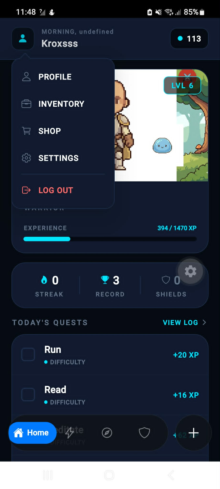
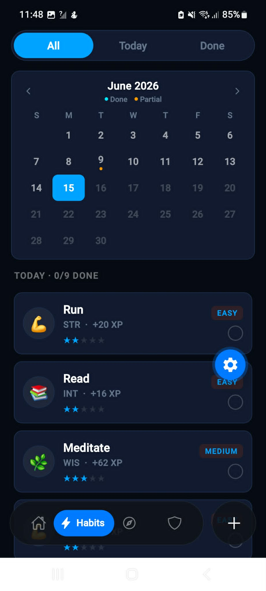
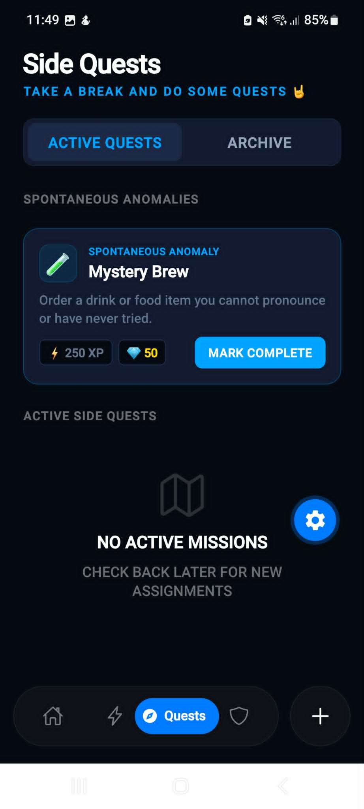
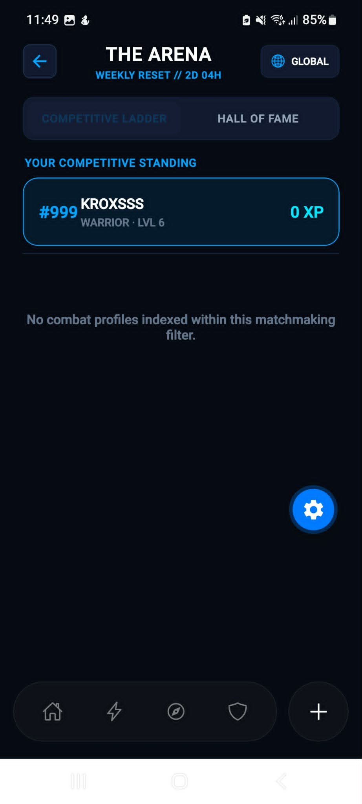

# HabitQuest 🎮

> Turn your daily habits into an RPG adventure. Build streaks, level up your character, and compete with friends.

<p align="center">
  
  
  
  
</p>

---

## 📱 Overview

HabitQuest is a mobile habit tracker built with an RPG twist. Instead of checking off boring to-do lists, you complete quests, earn XP, level up your character, and compete in The Arena against other players.

Built with React Native and Expo, backed by Supabase. Currently demo-ready and running locally.

---

## ✨ Features

- 🧙 **Character System** — Choose your class (Warrior, Mage, Rogue), customize your hero's appearance, and watch them level up as you build real habits
- ✅ **Habit Tracking** — Daily habits displayed as quests with difficulty ratings, stat bonuses (STR, INT, WIS, DEX), and XP rewards. Filter by All / Today / Done with a calendar view
- ⚔️ **Side Quests** — Spontaneous Anomalies: surprise one-off challenges that refresh daily (e.g. "Order a drink you can't pronounce")
- 🏆 **The Arena** — Competitive weekly leaderboard with global rankings, Competitive Ladder, and Hall of Fame. Resets every week
- 🛡️ **Guild System** — Create or join a guild with a custom tag and emblem. Track weekly guild XP targets and view your roster's activity log
- 🔥 **Streak Tracking** — Current streak, longest record, and streak shields displayed on the home dashboard
- 📦 **Inventory & Shop** — Earn and equip items. Navigate via Profile → Inventory or Shop from the home drawer
- 🔐 **Authentication** — OTP, Google OAuth, and biometric login via Supabase Auth

---

## 📸 Screenshots

| Home Dashboard | Habits | Side Quests | Guild |
|:-:|:-:|:-:|:-:|
|  |  |  |  |

| The Arena (Leaderboard) |
|:-:|
|  |

---

## 🛠 Tech Stack

| Layer | Tech |
|---|---|
| Framework | React Native (Expo SDK 55) |
| Language | TypeScript |
| Navigation | Expo Router |
| Styling | NativeWind |
| Backend | Supabase (PostgreSQL) |
| Auth | Supabase Auth — OTP, Google OAuth, Biometrics |
| Storage | Supabase Storage (avatar uploads) |
| Animations | React Native Reanimated |
| Icons | Ionicons |
| State | React Context + custom pub-sub (habitSheetEvents) |

---

## 🗄 Database Schema

13-table Supabase schema with RLS policies applied across all user-facing tables.

| Table | Description |
|---|---|
| `profiles` | Core user records linked to Supabase Auth |
| `heroes` | Character stats, class, appearance, level, XP, gold, streaks |
| `habits` | User-created habits with difficulty, stat type, frequency, rewards |
| `habit_logs` | Daily completion records with XP and gold granted |
| `quests` | Main quest board with conditions and rewards |
| `quest_progress` | Per-user quest completion tracking |
| `mystery_quests` | Pool of Spontaneous Anomaly side quests |
| `daily_mystery` | Daily assigned mystery quest per user |
| `guilds` | Guild records with name, tag, emblem, leader |
| `friendships` | Friend request and connection system |
| `duels` | PvP duel system with wagers and outcomes |
| `achievements` | Achievement definitions with XP rewards |
| `user_achievements` | Per-user unlocked achievements |
| `inventory` | Items owned by each hero |
| `items` | Item catalog with rarity, slot, and stat bonuses |
| `leaderboard_cache` | Weekly XP rankings cache |

---

## 🚀 Getting Started

### Prerequisites

- Node.js 18+
- Expo Go app on your phone, or an Android emulator
- A Supabase project

### Installation

```bash
git clone https://github.com/Kentlui2/HabitQuest.git
cd HabitQuest
npm install
```

### Environment Setup

Create a `.env` file in the root:

```env
EXPO_PUBLIC_SUPABASE_URL=your_supabase_url
EXPO_PUBLIC_SUPABASE_ANON_KEY=your_supabase_anon_key
```

### Run

```bash
npx expo start
```

Scan the QR code with Expo Go, or press `a` for Android emulator.

---

## 🐛 Known Issues / In Progress

- [ ] Character sprites not yet finalized
- [ ] Android BlurView rendering inconsistencies on some devices
- [ ] Leaderboard requires seeded users to populate (empty on fresh install)
- [ ] Not yet deployed to app stores — local/APK only

---

## 👤 Author

**Ken Lui**
GitHub: [@Kentlui2](https://github.com/Kentlui2)

---

## 📄 License

Built for academic and portfolio purposes.
